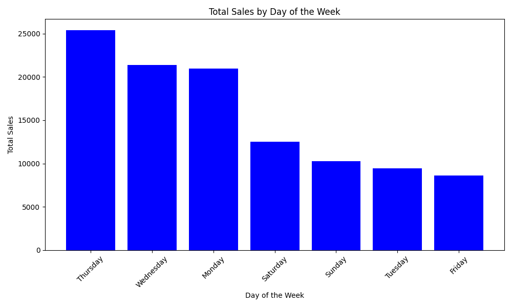

# OLAP Module
# P6 Module
 📁 Section 1: Business Goal

    Identify the most profitable product category by month and region over the last year.
    This helps the business target high-performing regions and focus inventory and marketing on top-selling product categories.

📁 Section 2: Data Source

    Source: Data warehouse (smart_sales.db)

    Tables Used:

        sales (order_date, sale_amount, product_id, customer_id)

        product (product_id, category)

        customer (customer_id, region)

📁 Section 3: Tools

    Python

    SQLite (via sqlite3)

    Pandas (for querying and manipulation)

    Matplotlib + Seaborn (for visualization)

📁 Section 4: Workflow & Logic

    Join Tables: sales → product → customer

    Group By: category, region, month

    Aggregate: SUM(sale_amount)

    Slicing: Filtered over all product categories

    Dicing: Breakdown by region and month

    Drilldown: By category → region → month

📁 Section 5: Results

    Chart: Bar chart of total sales by category and region.

    

📁 Section 6: Suggested Business Action

    Focus marketing efforts on top categories in high-performing regions.
    Consider improving stock availability in those regions to match demand patterns.

📁 Section 7: Challenges

    Seaborn module not installed initially

    Original OLAP cube file was missing — fixed by querying DB directly
    ## 📊 Total Sales by Day of the Week

This chart shows total sales grouped by weekday, sorted from highest to lowest:

