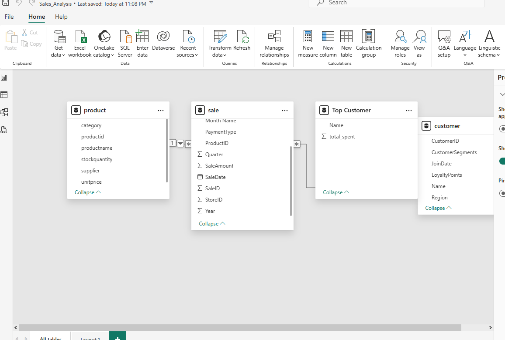
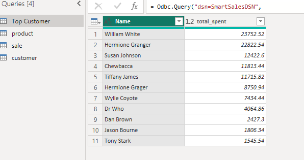
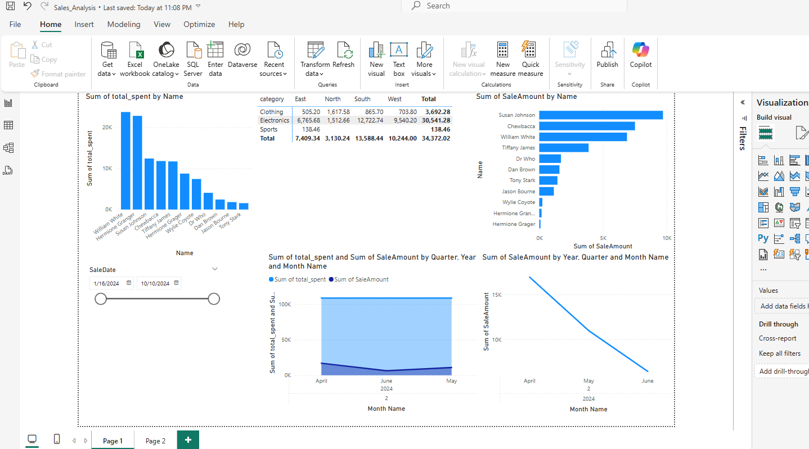

# smart-store-albert

Starter files to initialize the smart sales project.

-----

## Project Setup Guide (1-Mac/Linux)

Run all commands from a terminal in the root project folder. 

### Step 1A - Create a Local Project Virtual Environment

```shell
python3 -m venv .venv
```

### Step 1B - Activate the Virtual Environment

```shell
source .venv/bin/activate
```

### Step 1C - Install Packages

```shell
python3 -m pip install --upgrade -r requirements.txt
```

### Step 1D - Optional: Verify .venv Setup

```shell
python3 -m datafun_venv_checker.venv_checker
```

### Step 1E - Run the initial project script

```shell
python3 scripts/data_prep.py
```

-----

## Project Setup Guide (2-Windows)

Run all commands from a PowerShell terminal in the root project folder.

### Step 2A - Create a Local Project Virtual Environment

```shell
py -m venv .venv
```

### Step 2B - Activate the Virtual Environment

```shell
.venv\Scripts\activate
```

### Step 2C - Install Packages

```shell
py -m pip install --upgrade -r requirements.txt
```

## Module 2
- Create folder named utils in the root folder.
- Create file named logger.py
- Copy file from professor's directory into own logger.py file
- Create folder named scripts in the root folder.
- Create file named data_prep.py
- Copy file from professor's directory into own data_prep.py file (make sure all file names are lowercase and check spelling)
- Execute python script data_prep.py (I had to install pandas and restart terminal to run this)

```shell
py scripts/data_prep.py
```

- Add-Commit-Push to GitHub

```shell
git add .
git commit -m "Update Readme File"
git push
```

- Update Readme File

## What's Next?
- Coming soon!

-----

## Initial Package List

- pip
- loguru
- ipykernel
- jupyterlab
- numpy
- pandas
- matplotlib
- seaborn
- plotly
- pyspark==4.0.0.dev1
- pyspark[sql]
- git+https://github.com/denisecase/datafun-venv-checker.git#egg=datafun_venv_checker

## 📊 Data Warehouse Setup

This project includes a data warehouse created using SQLite. The schema includes the following tables:

- `customer`: Stores customer details such as name, region, join date, loyalty points, and segments.
- `product`: Contains product information including category, supplier, and pricing.
- `sale`: Records each sale transaction with details on store, campaign, discounts, and payment.

### ✅ Schema Verification

The schema was verified using the SQLite Viewer in VS Code.
Star Schema Design

This project uses a star schema for the data warehouse, which is a common dimensional modeling technique optimized for querying and reporting.
🔷 Fact Table

    sale: The central table that contains measurable, quantitative data (e.g., sale amount, discount, payment type).

        Each row represents a single transaction.

        It includes foreign keys to related dimension tables.

🔷 Dimension Tables

    customer: Contains descriptive information about customers (name, region, join date, loyalty points, etc.).

    product: Stores product-related attributes (category, unit price, supplier, etc.).

🔗 Schema Structure

In a star schema:

    The fact table sits in the center.

    The dimension tables surround it like points of a star.

    Relationships are maintained through foreign keys from the fact table to the dimension tables.

🧠 Why Use a Star Schema?

    Simple and intuitive design for analysts and business users.

    Optimized for OLAP (Online Analytical Processing) and data aggregation.

    Reduces the complexity of joins for queries.

### SQL Queries & Data Model

- Connected to SQLite database using ODBC in Power BI.
- Wrote SQL to summarize total sales by customer:
  ```sql
  Odbc.Query  ("dsn=SmartSalesDSN", 
    "SELECT c.Name, SUM(s.SaleAmount) AS total_spent
     FROM sale s
     JOIN Customer c ON s.CustomerID = c.CustomerID
     GROUP BY c.Name
     ORDER BY total_spent DESC"
)
Transformed order_date into year, quarter, and month for drilldowns.

Created relationships between Customer, Sale, and Product tables.
  
---

### 🔹 STEP 3: Explain Dashboard Design Choices

Copy & paste this too:

```markdown
### Dashboard Design Choices

- Bar chart to show top customers by total spent.
- Line chart to track sales trends by year → quarter → month.
- Slicer for product category to filter across visuals.
- Drilldown enabled on time axis for multi-level analysis.
### Power BI Data Model View



### SQL Query Results


### Final Dashboard



/Projects\smart-store-albert
  ├── README.md
  ├── model_view.png
  ├── query_results.png
  ├── dashboard.png

